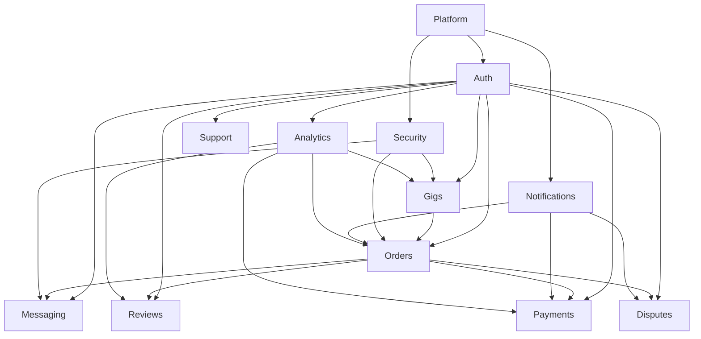
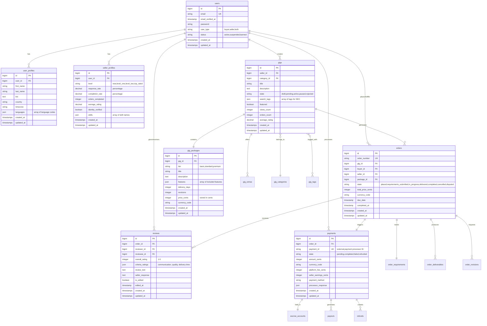

# Fiverr-Like Marketplace Engineering Blueprint

## Laravel 12 + PHP 8.3 + Mandated Packages Implementation

**Author:** Senior Laravel 12 Architect  
**Date:** 2025-08-30  
**Framework:** Laravel 12.x  
**PHP Version:** 8.3+ (strict types)  

---

## Table of Contents

1. [Executive Summary](#executive-summary)
2. [Business Requirements Analysis](#business-requirements-analysis)
3. [Technology Stack & Package Integration](#technology-stack--package-integration)
4. [Modular Architecture Plan](#modular-architecture-plan)
5. [Database Design & ERD](#database-design--erd)
6. [Package Implementation Examples](#package-implementation-examples)
7. [Module Examples (Auth & Gigs)](#module-examples-auth--gigs)
8. [Documentation Templates](#documentation-templates)
9. [Testing Strategy](#testing-strategy)
10. [CI/CD Pipeline](#cicd-pipeline)
11. [Risk Register](#risk-register)

---

## Executive Summary

This blueprint provides a comprehensive engineering plan for building a Fiverr-like marketplace using Laravel 12, PHP 8.3, and the mandated Spatie packages. The architecture follows a modular monorepo approach using nWidart/laravel-modules, ensuring scalability, maintainability, and testability.

**Key Technical Decisions:**
- **Modular Architecture**: Each business domain is a separate Laravel module
- **State Management**: Order lifecycle managed with spatie/laravel-model-states
- **Media Handling**: Portfolio, gig galleries, and deliveries via spatie/laravel-medialibrary
- **Permissions**: Role-based access control with spatie/laravel-permission
- **Data Transfer**: Type-safe DTOs with spatie/laravel-data
- **Money Handling**: All financial calculations via cknow/laravel-money
- **Admin Interface**: Filament v4 for comprehensive admin panels
- **Frontend**: Livewire for interactive components

---

## Business Requirements Analysis

### Core Fiverr Mechanics Identified

Based on comprehensive research of Fiverr.com, the following core mechanics must be implemented:

#### 1. **Service-as-a-Product Model**
- Digital services packaged as discrete "Gigs" with fixed pricing
- Three-tier packages: Basic, Standard, Premium
- Add-ons and extras for additional value
- Search-based discovery rather than project bidding

#### 2. **Two-Sided Marketplace**
- **Sellers (Freelancers)**: Create gigs, fulfill orders, manage profiles
- **Buyers (Clients)**: Browse services, place orders, provide requirements
- **Platform**: Facilitates transactions, manages disputes, ensures quality

#### 3. **Order Lifecycle States**
```
Order Placed → Requirements Submitted → In Progress → Delivered → 
Under Review → Completed/Disputed
```

#### 4. **Revenue Model**
- **Seller Commission**: 20% on all earnings
- **Buyer Service Fee**: 5.5% of order value
- **High-Value Order Fee**: Additional 5% on amounts over $500
- **Escrow System**: Funds held until delivery confirmation

#### 5. **Trust & Safety Features**
- Multi-level seller progression system
- Review and rating system (last 2 years performance)
- Dispute resolution center
- Automated content moderation
- Identity verification

---

## Technology Stack & Package Integration

### Mandated Packages Configuration

```json
{
    "name": "company/fiverr-marketplace",
    "description": "Fiverr-like marketplace built with Laravel 12",
    "type": "project",
    "require": {
        "php": "^8.3",
        "laravel/framework": "^12.0",
        "livewire/livewire": "^3.0",
        "filament/filament": "^4.0",
        "spatie/laravel-medialibrary": "^11.0",
        "spatie/laravel-data": "^4.0",
        "spatie/laravel-settings": "^3.0",
        "spatie/laravel-model-states": "^2.0",
        "spatie/laravel-permission": "^6.0",
        "cknow/laravel-money": "^8.0",
        "nwidart/laravel-modules": "^11.0"
    },
    "require-dev": {
        "pestphp/pest": "^2.0",
        "pestphp/pest-plugin-laravel": "^2.0",
        "larastan/larastan": "^2.9",
        "rector/rector": "^0.18"
    },
    "config": {
        "optimize-autoloader": true,
        "preferred-install": "dist",
        "sort-packages": true,
        "allow-plugins": {
            "pestphp/pest-plugin": true,
            "wikimedia/composer-merge-plugin": true
        }
    },
    "extra": {
        "laravel": {
            "dont-discover": []
        },
        "merge-plugin": {
            "include": [
                "Modules/*/composer.json"
            ]
        }
    }
}
```

### Package Integration Strategy

#### 1. **spatie/laravel-medialibrary** 
- **Purpose**: Handle gig galleries, portfolios, delivery files, user avatars
- **Integration**: HasMedia trait on User, Gig, Order models
- **Collections**: 'avatar', 'portfolio', 'gig-gallery', 'deliverables'

#### 2. **spatie/laravel-data**
- **Purpose**: Type-safe DTOs for API responses, form validation
- **Integration**: GigData, OrderData, UserProfileData, PaymentData
- **Features**: Automatic validation, TypeScript generation

#### 3. **spatie/laravel-settings**
- **Purpose**: Platform configuration, commission rates, feature flags
- **Integration**: PlatformSettings, PaymentSettings, SecuritySettings
- **Storage**: Database with caching

#### 4. **spatie/laravel-model-states**
- **Purpose**: Order lifecycle, gig approval, user verification states
- **Integration**: OrderState, GigState, UserState classes
- **Transitions**: Automated and manual state changes

#### 5. **spatie/laravel-permission**
- **Purpose**: Role-based access control
- **Roles**: Admin, Moderator, Seller, Buyer, Support
- **Permissions**: Granular permissions per module

#### 6. **cknow/laravel-money**
- **Purpose**: All financial calculations, commission tracking
- **Integration**: Money casting on all price fields
- **Features**: Multi-currency support, precise calculations

#### 7. **nWidart/laravel-modules**
- **Purpose**: Modular architecture organization
- **Structure**: Business domain separation
- **Benefits**: Independent development, testing, deployment

#### 8. **Filament v4**
- **Purpose**: Admin panels, moderator tools, analytics dashboards
- **Integration**: Resources for all models, custom widgets
- **Features**: Multi-tenancy, role-based access

---

## Modular Architecture Plan

### Module Structure Overview

```
Modules/
├── Auth/                   # User authentication & profile management
├── Gigs/                   # Gig creation, management, search
├── Orders/                 # Order processing, state management
├── Messaging/              # In-platform communication
├── Reviews/                # Rating and review system
├── Payments/               # Payment processing, escrow, payouts
├── Disputes/               # Dispute resolution system
├── Analytics/              # Business intelligence, reporting
├── Notifications/          # Email, SMS, in-app notifications
├── Security/               # Fraud detection, content moderation
├── Support/                # Customer support tools
└── Platform/               # Global settings, system configuration
```

### Module Dependency Map



### Module 1: Auth Module

**Purpose**: Complete user authentication, authorization, and profile management system.

**Packages Used**: 
- spatie/laravel-permission (roles & permissions)
- spatie/laravel-medialibrary (profile images, portfolios)
- spatie/laravel-data (profile DTOs)
- spatie/laravel-model-states (verification states)

**Key Features**:
- Multi-role registration (Buyer/Seller)
- Email verification with OTP
- Social media authentication
- Profile management with portfolios
- Seller level progression system
- Identity verification workflow

**Database Tables**:
- users
- user_profiles
- seller_profiles
- user_verifications
- roles (from spatie/permission)
- permissions (from spatie/permission)
- model_has_permissions (from spatie/permission)
- model_has_roles (from spatie/permission)

### Module 2: Gigs Module

**Purpose**: Complete gig lifecycle management from creation to publication.

**Packages Used**:
- spatie/laravel-medialibrary (gig galleries, videos)
- spatie/laravel-data (gig DTOs)
- spatie/laravel-model-states (approval states)
- cknow/laravel-money (pricing)

**Key Features**:
- Multi-tier package creation (Basic/Standard/Premium)
- Rich media support (images, videos, PDFs)
- SEO optimization tools
- Category and tag management
- Automated pricing validation
- Gig approval workflow

**Database Tables**:
- gigs
- gig_packages
- gig_extras
- gig_categories
- gig_tags
- gig_faqs
- gig_requirements

### Module 3: Orders Module

**Purpose**: Complete order processing with state management and automation.

**Packages Used**:
- spatie/laravel-model-states (order lifecycle)
- spatie/laravel-medialibrary (requirement files, deliverables)
- cknow/laravel-money (order totals, commissions)
- spatie/laravel-data (order DTOs)

**Key Features**:
- Automated order state transitions
- Requirements collection system
- Delivery management
- Revision handling
- Auto-completion after 3 days
- Commission calculation

**Database Tables**:
- orders
- order_requirements
- order_deliverables
- order_revisions
- order_state_transitions
- order_extras

### Module 4: Payments Module

**Purpose**: Secure payment processing, escrow management, and payout system.

**Packages Used**:
- cknow/laravel-money (all financial calculations)
- spatie/laravel-data (payment DTOs)
- spatie/laravel-model-states (payment states)

**Key Features**:
- Multi-gateway payment processing
- Escrow fund management
- Automated commission calculation
- Seller payout scheduling
- Refund processing
- Financial reporting

**Database Tables**:
- payments
- escrow_accounts
- payouts
- refunds
- commission_records
- transaction_logs

### Module 5: Reviews Module

**Purpose**: Review and rating system with performance analytics.

**Packages Used**:
- spatie/laravel-data (review DTOs)
- spatie/laravel-medialibrary (review attachments)

**Key Features**:
- Multi-criteria ratings
- Editable reviews (post-submission)
- Performance aggregation (last 2 years)
- Review verification
- Fake review detection

**Database Tables**:
- reviews
- review_criteria
- review_responses
- review_reports

---

## Database Design & ERD

### Core Entity Relationship Diagram



### Database Schema Considerations

#### 1. **Money Storage Pattern**
All monetary values stored as integers in base currency units (cents) with separate currency code:
```sql
price_cents INTEGER NOT NULL,
currency_code VARCHAR(3) NOT NULL DEFAULT 'USD'
```

#### 2. **State Management Schema**
Using spatie/laravel-model-states requires state column:
```sql
state VARCHAR(100) NOT NULL DEFAULT 'initial_state'
```

#### 3. **Media Library Integration**
Automatic media table creation via spatie/laravel-medialibrary migration:
```sql
-- Auto-generated by package
media (id, model_type, model_id, uuid, collection_name, name, file_name, mime_type, disk, conversions_disk, size, manipulations, custom_properties, generated_conversions, responsive_images, order_column, created_at, updated_at)
```

#### 4. **Permission System Schema**
spatie/laravel-permission creates required tables:
```sql
-- Auto-generated by package
roles, permissions, model_has_permissions, model_has_roles, role_has_permissions
```

---

## Package Implementation Examples

### 1. spatie/laravel-medialibrary Integration

#### User Model with Media Support

```php
<?php

declare(strict_types=1);

namespace Modules\Auth\Models;

use Illuminate\Database\Eloquent\Factories\HasFactory;
use Illuminate\Foundation\Auth\User as Authenticatable;
use Illuminate\Notifications\Notifiable;
use Laravel\Sanctum\HasApiTokens;
use Spatie\MediaLibrary\HasMedia;
use Spatie\MediaLibrary\InteractsWithMedia;
use Spatie\MediaLibrary\MediaCollections\Models\Media;
use Spatie\Permission\Traits\HasRoles;
use Modules\Auth\Database\Factories\UserFactory;

/**
 * User model with comprehensive media support for marketplace functionality.
 * 
 * Handles user authentication, profile management, and media attachments
 * including avatars, portfolio items, and verification documents.
 * 
 * @property int $id
 * @property string $email
 * @property string $user_type Enum: buyer, seller, both
 * @property string $status Enum: active, suspended, banned
 * @property \Illuminate\Support\Carbon $email_verified_at
 * @property-read \Illuminate\Database\Eloquent\Collection<\Spatie\MediaLibrary\MediaCollections\Models\Media> $media
 */
class User extends Authenticatable implements HasMedia
{
    use HasApiTokens;
    use HasFactory;
    use Notifiable;
    use InteractsWithMedia;
    use HasRoles;

    /**
     * The attributes that are mass assignable.
     *
     * @var array<int, string>
     */
    protected $fillable = [
        'email',
        'password',
        'user_type',
        'status',
        'email_verified_at',
    ];

    /**
     * The attributes that should be hidden for serialization.
     *
     * @var array<int, string>
     */
    protected $hidden = [
        'password',
        'remember_token',
    ];

    /**
     * Get the attributes that should be cast.
     *
     * @return array<string, string>
     */
    protected function casts(): array
    {
        return [
            'email_verified_at' => 'datetime',
            'password' => 'hashed',
            'user_type' => 'string',
            'status' => 'string',
        ];
    }

    /**
     * Define media collections for different types of user media.
     * 
     * Each collection serves a specific purpose in the marketplace:
     * - avatar: Single profile picture
     * - portfolio: Multiple work samples for sellers
     * - verification: Identity documents for KYC
     *
     * @return void
     */
    public function registerMediaCollections(): void
    {
        // Profile avatar - single file, optimized for web display
        $this->addMediaCollection('avatar')
            ->singleFile()
            ->acceptsMimeTypes(['image/jpeg', 'image/png', 'image/webp']);

        // Portfolio items for sellers - multiple files with size limits
        $this->addMediaCollection('portfolio')
            ->acceptsMimeTypes(['image/jpeg', 'image/png', 'image/webp', 'application/pdf', 'video/mp4']);

        // Identity verification documents - secure, single use
        $this->addMediaCollection('verification')
            ->acceptsMimeTypes(['image/jpeg', 'image/png', 'application/pdf']);
    }

    /**
     * Define media conversions for automated image processing.
     * 
     * Creates optimized versions of uploaded images for different display contexts.
     * Improves performance and user experience across the platform.
     *
     * @param Media|null $media The media item being processed
     * @return void
     */
    public function registerMediaConversions(?Media $media = null): void
    {
        // Avatar conversions for different UI contexts
        $this->addMediaConversion('avatar-large')
            ->width(400)
            ->height(400)
            ->sharpen(10)
            ->performOnCollections('avatar');

        $this->addMediaConversion('avatar-medium')
            ->width(150)
            ->height(150)
            ->sharpen(10)
            ->performOnCollections('avatar');

        $this->addMediaConversion('avatar-small')
            ->width(64)
            ->height(64)
            ->sharpen(10)
            ->performOnCollections('avatar');

        // Portfolio item thumbnails for gallery displays
        $this->addMediaConversion('portfolio-thumb')
            ->width(300)
            ->height(200)
            ->sharpen(10)
            ->performOnCollections('portfolio');

        // Portfolio large view for detailed inspection
        $this->addMediaConversion('portfolio-large')
            ->width(800)
            ->height(600)
            ->sharpen(10)
            ->performOnCollections('portfolio');
    }

    /**
     * Get the user's avatar URL with fallback.
     * 
     * Provides a consistent way to retrieve user avatar across the application.
     * Falls back to default avatar if none uploaded.
     *
     * @param string $conversion The image conversion to retrieve
     * @return string The avatar URL
     */
    public function getAvatarUrl(string $conversion = 'avatar-medium'): string
    {
        $avatar = $this->getFirstMedia('avatar');
        
        if ($avatar) {
            return $avatar->getUrl($conversion);
        }
        
        // Fallback to default avatar based on user initials
        return $this->generateDefaultAvatar();
    }

    /**
     * Generate a default avatar URL based on user initials.
     * 
     * Creates a consistent fallback avatar when users haven't uploaded one.
     * Uses a service like UI Avatars or generates locally.
     *
     * @return string Default avatar URL
     */
    private function generateDefaultAvatar(): string
    {
        $initials = strtoupper(substr($this->email, 0, 2));
        return "https://ui-avatars.com/api/?name={$initials}&background=6366f1&color=fff&size=150";
    }

    /**
     * Get portfolio items with proper ordering.
     * 
     * Returns portfolio media items sorted by custom order column.
     * Used for seller profile displays and gig creation interfaces.
     *
     * @return \Illuminate\Database\Eloquent\Collection<\Spatie\MediaLibrary\MediaCollections\Models\Media>
     */
    public function getPortfolioItems()
    {
        return $this->getMedia('portfolio')->sortBy('order_column');
    }

    /**
     * Check if user has completed identity verification.
     * 
     * Verifies that required verification documents have been uploaded
     * and approved by the platform's verification process.
     *
     * @return bool True if identity is verified
     */
    public function isIdentityVerified(): bool
    {
        return $this->getMedia('verification')->isNotEmpty() 
            && $this->hasVerifiedAt('identity_verified');
    }

    /**
     * Create a new factory instance for the model.
     *
     * @return \Illuminate\Database\Eloquent\Factories\Factory<static>
     */
    protected static function newFactory()
    {
        return UserFactory::new();
    }
}
```

#### Media Usage in Controllers

```php
<?php

declare(strict_types=1);

namespace Modules\Auth\Http\Controllers;

use Illuminate\Http\JsonResponse;
use Illuminate\Http\Request;
use Illuminate\Routing\Controller;
use Illuminate\Support\Facades\Storage;
use Illuminate\Validation\Rules\File;
use Modules\Auth\Models\User;
use Modules\Auth\Data\ProfileUpdateData;

/**
 * Profile media management controller.
 * 
 * Handles upload, update, and deletion of user profile media including
 * avatars, portfolio items, and verification documents.
 */
class ProfileMediaController extends Controller
{
    /**
     * Upload user avatar with validation and processing.
     * 
     * Validates uploaded image, processes it through media library conversions,
     * and updates user's profile avatar. Replaces existing avatar if present.
     *
     * @param Request $request HTTP request containing the uploaded file
     * @return JsonResponse Avatar upload response with URL
     * 
     * @throws \Illuminate\Validation\ValidationException If file validation fails
     */
    public function uploadAvatar(Request $request): JsonResponse
    {
        $request->validate([
            'avatar' => [
                'required',
                File::image()
                    ->max('5mb')
                    ->dimensions(minWidth: 100, minHeight: 100)
            ]
        ]);

        /** @var User $user */
        $user = auth()->user();
        
        // Remove existing avatar before adding new one (singleFile collection)
        $user->clearMediaCollection('avatar');
        
        // Add new avatar with automatic processing
        $media = $user
            ->addMediaFromRequest('avatar')
            ->usingFileName(fn($originalFilename) => "avatar-{$user->id}-" . time() . '.' . pathinfo($originalFilename, PATHINFO_EXTENSION))
            ->toMediaCollection('avatar');

        // Return avatar URLs for immediate UI update
        return response()->json([
            'success' => true,
            'avatar_urls' => [
                'small' => $media->getUrl('avatar-small'),
                'medium' => $media->getUrl('avatar-medium'),
                'large' => $media->getUrl('avatar-large'),
            ],
            'message' => 'Avatar uploaded successfully'
        ]);
    }

    /**
     * Add portfolio item with metadata and processing.
     * 
     * Handles upload of portfolio items including images, videos, and PDFs.
     * Automatically processes media conversions and maintains order.
     *
     * @param Request $request HTTP request with portfolio file and metadata
     * @return JsonResponse Portfolio item upload response
     */
    public function addPortfolioItem(Request $request): JsonResponse
    {
        $request->validate([
            'file' => [
                'required',
                File::types(['jpg', 'jpeg', 'png', 'webp', 'pdf', 'mp4'])
                    ->max('20mb')
            ],
            'title' => 'required|string|max:100',
            'description' => 'nullable|string|max:500',
        ]);

        /** @var User $user */
        $user = auth()->user();
        
        // Get next order position for portfolio
        $nextOrder = $user->getMedia('portfolio')->count() + 1;
        
        $media = $user
            ->addMediaFromRequest('file')
            ->withCustomProperties([
                'title' => $request->string('title'),
                'description' => $request->string('description'),
                'order' => $nextOrder,
            ])
            ->toMediaCollection('portfolio');

        return response()->json([
            'success' => true,
            'portfolio_item' => [
                'id' => $media->id,
                'title' => $media->getCustomProperty('title'),
                'description' => $media->getCustomProperty('description'),
                'file_name' => $media->file_name,
                'mime_type' => $media->mime_type,
                'urls' => $this->getMediaUrls($media),
            ],
            'message' => 'Portfolio item added successfully'
        ]);
    }

    /**
     * Reorder portfolio items by updating order column.
     * 
     * Allows sellers to customize the display order of their portfolio items.
     * Updates the order_column for batch reordering.
     *
     * @param Request $request HTTP request with new order array
     * @return JsonResponse Reorder operation response
     */
    public function reorderPortfolio(Request $request): JsonResponse
    {
        $request->validate([
            'items' => 'required|array',
            'items.*.id' => 'required|integer|exists:media,id',
            'items.*.order' => 'required|integer|min:1',
        ]);

        /** @var User $user */
        $user = auth()->user();
        
        foreach ($request->array('items') as $item) {
            $media = $user->getMedia('portfolio')->where('id', $item['id'])->first();
            if ($media) {
                $media->order_column = $item['order'];
                $media->save();
            }
        }

        return response()->json([
            'success' => true,
            'message' => 'Portfolio reordered successfully'
        ]);
    }

    /**
     * Remove portfolio item with cleanup.
     * 
     * Deletes portfolio item and all associated conversions from storage.
     * Reorders remaining items to maintain sequence.
     *
     * @param Request $request HTTP request with media ID
     * @param int $mediaId Media item ID to remove
     * @return JsonResponse Removal response
     */
    public function removePortfolioItem(Request $request, int $mediaId): JsonResponse
    {
        /** @var User $user */
        $user = auth()->user();
        
        $media = $user->getMedia('portfolio')->where('id', $mediaId)->first();
        
        if (!$media) {
            return response()->json([
                'success' => false,
                'message' => 'Portfolio item not found'
            ], 404);
        }

        // Store order for reordering remaining items
        $removedOrder = $media->order_column;
        
        // Delete media and all conversions
        $media->delete();
        
        // Reorder remaining items
        $user->getMedia('portfolio')
            ->where('order_column', '>', $removedOrder)
            ->each(function ($item) {
                $item->order_column = $item->order_column - 1;
                $item->save();
            });

        return response()->json([
            'success' => true,
            'message' => 'Portfolio item removed successfully'
        ]);
    }

    /**
     * Get appropriate URLs for media item based on type.
     * 
     * Returns different URL sets depending on media type (image, video, PDF).
     * Provides consistent interface for frontend display.
     *
     * @param \Spatie\MediaLibrary\MediaCollections\Models\Media $media
     * @return array<string, string> Array of URLs for different conversions
     */
    private function getMediaUrls($media): array
    {
        if (str_starts_with($media->mime_type, 'image/')) {
            return [
                'thumbnail' => $media->getUrl('portfolio-thumb'),
                'large' => $media->getUrl('portfolio-large'),
                'original' => $media->getUrl(),
            ];
        }
        
        // For videos and PDFs, return original URL
        return [
            'original' => $media->getUrl(),
        ];
    }
}
```

### 2. spatie/laravel-data Integration

#### Data Transfer Objects for API Consistency

```php
<?php

declare(strict_types=1);

namespace Modules\Gigs\Data;

use Carbon\Carbon;
use Money\Money;
use Spatie\LaravelData\Attributes\DataCollectionOf;
use Spatie\LaravelData\Attributes\MapInputName;
use Spatie\LaravelData\Attributes\MapOutputName;
use Spatie\LaravelData\Attributes\Validation\Min;
use Spatie\LaravelData\Attributes\Validation\Required;
use Spatie\LaravelData\Attributes\Validation\StringType;
use Spatie\LaravelData\Data;
use Spatie\LaravelData\DataCollection;
use Modules\Gigs\Models\Gig;

/**
 * Gig data transfer object for API responses and form validation.
 * 
 * Provides type-safe data handling for gig-related operations including
 * creation, updates, and API responses. Automatically validates input
 * and transforms data for consistent API output.
 * 
 * Used for:
 * - Gig creation and update forms
 * - API response serialization
 * - Frontend TypeScript type generation
 * - Validation rule centralization
 */
class GigData extends Data
{
    /**
     * Create new GigData instance.
     *
     * @param int|null $id Gig identifier (null for creation)
     * @param string $title Gig title for display and SEO
     * @param string $description Detailed gig description with features
     * @param int $category_id Category classification ID
     * @param array<string> $tags Array of search tags for discoverability
     * @param string $state Current gig state (draft, pending, active, etc.)
     * @param DataCollection<GigPackageData> $packages Pricing tier packages (Basic/Standard/Premium)
     * @param DataCollection<GigExtraData> $extras Optional add-on services
     * @param DataCollection<GigFaqData> $faqs Frequently asked questions
     * @param DataCollection<GigRequirementData> $requirements Information needed from buyers
     * @param array<string> $gallery_urls Media gallery URLs for display
     * @param int $views_count Total gig view counter
     * @param int $orders_count Completed orders counter
     * @param float $average_rating Average customer rating (1-5 scale)
     * @param Carbon $created_at Record creation timestamp
     * @param Carbon $updated_at Record last update timestamp
     */
    public function __construct(
        public readonly ?int $id,
        
        #[Required]
        #[StringType]
        #[Min(10)]
        #[MapInputName('gig_title')]
        #[MapOutputName('title')]
        public readonly string $title,
        
        #[Required]
        #[StringType]
        #[Min(50)]
        public readonly string $description,
        
        #[Required]
        #[MapInputName('category')]
        public readonly int $category_id,
        
        public readonly array $tags,
        
        public readonly string $state,
        
        #[DataCollectionOf(GigPackageData::class)]
        public readonly DataCollection $packages,
        
        #[DataCollectionOf(GigExtraData::class)]
        public readonly DataCollection $extras,
        
        #[DataCollectionOf(GigFaqData::class)]
        public readonly DataCollection $faqs,
        
        #[DataCollectionOf(GigRequirementData::class)]
        public readonly DataCollection $requirements,
        
        #[MapOutputName('gallery')]
        public readonly array $gallery_urls,
        
        public readonly int $views_count,
        public readonly int $orders_count,
        public readonly float $average_rating,
        public readonly Carbon $created_at,
        public readonly Carbon $updated_at,
    ) {}

    /**
     * Create GigData from Eloquent model.
     * 
     * Transforms Gig model with relationships into type-safe DTO.
     * Handles media URLs, package data, and computed properties.
     *
     * @param Gig $gig Eloquent gig model with loaded relationships
     * @return static Populated GigData instance
     */
    public static function fromModel(Gig $gig): static
    {
        return new static(
            id: $gig->id,
            title: $gig->title,
            description: $gig->description,
            category_id: $gig->category_id,
            tags: $gig->search_tags ?? [],
            state: $gig->state,
            packages: GigPackageData::collection($gig->packages),
            extras: GigExtraData::collection($gig->extras),
            faqs: GigFaqData::collection($gig->faqs),
            requirements: GigRequirementData::collection($gig->requirements),
            gallery_urls: $gig->getMedia('gallery')->map(fn($media) => [
                'id' => $media->id,
                'url' => $media->getUrl(),
                'thumbnail' => $media->getUrl('thumbnail'),
                'type' => str_starts_with($media->mime_type, 'image/') ? 'image' : 'video',
            ])->toArray(),
            views_count: $gig->views_count,
            orders_count: $gig->orders_count,
            average_rating: (float) $gig->average_rating,
            created_at: $gig->created_at,
            updated_at: $gig->updated_at,
        );
    }

    /**
     * Validation rules for gig creation and updates.
     * 
     * Centralizes validation logic for consistent form and API validation.
     * Rules are automatically applied when creating DTO from request data.
     *
     * @return array<string, mixed> Laravel validation rules
     */
    public static function rules(): array
    {
        return [
            'title' => ['required', 'string', 'min:10', 'max:80'],
            'description' => ['required', 'string', 'min:50', 'max:1200'],
            'category_id' => ['required', 'integer', 'exists:gig_categories,id'],
            'tags' => ['required', 'array', 'min:3', 'max:10'],
            'tags.*' => ['required', 'string', 'max:20'],
            'packages' => ['required', 'array', 'min:1', 'max:3'],
            'packages.*.tier' => ['required', 'in:basic,standard,premium'],
            'packages.*.price' => ['required', 'numeric', 'min:5', 'max:10000'],
            'packages.*.delivery_days' => ['required', 'integer', 'min:1', 'max:30'],
            'packages.*.revisions' => ['required', 'integer', 'min:0', 'max:10'],
            'extras' => ['sometimes', 'array', 'max:10'],
            'faqs' => ['sometimes', 'array', 'max:10'],
            'requirements' => ['sometimes', 'array', 'max:20'],
        ];
    }

    /**
     * Transform DTO for API response with computed fields.
     * 
     * Adds calculated fields and formats data for consistent API output.
     * Handles currency formatting, URL generation, and frontend-friendly formats.
     *
     * @return array<string, mixed> Transformed data for API response
     */
    public function transform(): array
    {
        return [
            'id' => $this->id,
            'title' => $this->title,
            'description' => $this->description,
            'category_id' => $this->category_id,
            'tags' => $this->tags,
            'state' => $this->state,
            'packages' => $this->packages->toArray(),
            'extras' => $this->extras->toArray(),
            'faqs' => $this->faqs->toArray(),
            'requirements' => $this->requirements->toArray(),
            'gallery' => $this->gallery_urls,
            'statistics' => [
                'views' => $this->views_count,
                'orders' => $this->orders_count,
                'rating' => round($this->average_rating, 1),
                'rating_display' => $this->formatRatingDisplay(),
            ],
            'pricing' => [
                'starting_at' => $this->getStartingPrice(),
                'currency' => 'USD', // TODO: Support multi-currency
                'formatted_starting_price' => $this->formatStartingPrice(),
            ],
            'timestamps' => [
                'created_at' => $this->created_at->toISOString(),
                'updated_at' => $this->updated_at->toISOString(),
                'created_at_human' => $this->created_at->diffForHumans(),
                'updated_at_human' => $this->updated_at->diffForHumans(),
            ],
        ];
    }

    /**
     * Get starting price from basic package.
     * 
     * Returns the lowest available price across all packages.
     * Used for search result displays and pricing comparisons.
     *
     * @return int Starting price in cents
     */
    private function getStartingPrice(): int
    {
        return $this->packages->min('price_cents') ?? 0;
    }

    /**
     * Format starting price for display.
     * 
     * Converts price from cents to formatted currency string.
     * Handles different currency formats and localization.
     *
     * @return string Formatted price string (e.g., "$25.00")
     */
    private function formatStartingPrice(): string
    {
        $price = Money::USD($this->getStartingPrice());
        return $price->getAmount() / 100; // Convert to dollars for display
    }

    /**
     * Format rating for display with stars.
     * 
     * Creates user-friendly rating display with star visualization.
     * Handles cases with no ratings yet.
     *
     * @return string Formatted rating display
     */
    private function formatRatingDisplay(): string
    {
        if ($this->average_rating === 0.0) {
            return 'No ratings yet';
        }
        
        $stars = str_repeat('★', (int) round($this->average_rating));
        $empty_stars = str_repeat('☆', 5 - (int) round($this->average_rating));
        
        return sprintf('%s%s (%.1f)', $stars, $empty_stars, $this->average_rating);
    }
}
```

#### Package Data DTO

```php
<?php

declare(strict_types=1);

namespace Modules\Gigs\Data;

use Money\Money;
use Spatie\LaravelData\Attributes\Validation\Min;
use Spatie\LaravelData\Attributes\Validation\Required;
use Spatie\LaravelData\Data;

/**
 * Gig package data transfer object for pricing tier management.
 * 
 * Handles the three-tier pricing structure (Basic/Standard/Premium)
 * that forms the core of Fiverr's service productization model.
 * 
 * Each package represents a different service level with:
 * - Progressive pricing (Basic < Standard < Premium)
 * - Incremental features and deliverables
 * - Different delivery timeframes
 * - Varying revision allowances
 */
class GigPackageData extends Data
{
    /**
     * Create new GigPackageData instance.
     *
     * @param int|null $id Package identifier (null for creation)
     * @param string $tier Package tier (basic, standard, premium)
     * @param string $title Short package title for display
     * @param string $description Detailed package description
     * @param array<string> $features Array of included features
     * @param int $price_cents Price in base currency units (cents)
     * @param string $currency_code Currency code (ISO 4217)
     * @param int $delivery_days Delivery timeframe in days
     * @param int $revisions Number of included revisions
     */
    public function __construct(
        public readonly ?int $id,
        
        #[Required]
        public readonly string $tier,
        
        #[Required]
        public readonly string $title,
        
        #[Required]
        #[Min(20)]
        public readonly string $description,
        
        public readonly array $features,
        
        #[Required]
        #[Min(500)] // Minimum $5.00
        public readonly int $price_cents,
        
        public readonly string $currency_code,
        
        #[Required]
        #[Min(1)]
        public readonly int $delivery_days,
        
        #[Min(0)]
        public readonly int $revisions,
    ) {}

    /**
     * Transform package data for API response.
     * 
     * Adds formatted pricing, delivery estimates, and tier-specific styling.
     * Provides consistent formatting across the platform.
     *
     * @return array<string, mixed> Transformed package data
     */
    public function transform(): array
    {
        $money = Money::USD($this->price_cents);
        
        return [
            'id' => $this->id,
            'tier' => $this->tier,
            'title' => $this->title,
            'description' => $this->description,
            'features' => $this->features,
            'pricing' => [
                'price_cents' => $this->price_cents,
                'currency' => $this->currency_code,
                'formatted_price' => '$' . ($this->price_cents / 100),
                'display_price' => number_format($this->price_cents / 100, 2),
            ],
            'delivery' => [
                'days' => $this->delivery_days,
                'formatted' => $this->formatDeliveryTime(),
                'business_days_note' => 'Delivery time is calculated in business days',
            ],
            'revisions' => [
                'count' => $this->revisions,
                'formatted' => $this->formatRevisions(),
            ],
            'tier_styling' => [
                'color' => $this->getTierColor(),
                'badge' => $this->getTierBadge(),
                'is_popular' => $this->tier === 'standard', // Mark standard as popular
            ],
        ];
    }

    /**
     * Format delivery time for user display.
     * 
     * Creates human-readable delivery time descriptions.
     * Handles singular/plural forms and express delivery options.
     *
     * @return string Formatted delivery time
     */
    private function formatDeliveryTime(): string
    {
        if ($this->delivery_days === 1) {
            return '1 day delivery';
        }
        
        if ($this->delivery_days <= 3) {
            return $this->delivery_days . ' days (Express)';
        }
        
        return $this->delivery_days . ' days delivery';
    }

    /**
     * Format revision count for display.
     * 
     * Handles special cases like unlimited revisions or no revisions.
     * Provides clear expectations for buyers.
     *
     * @return string Formatted revision description
     */
    private function formatRevisions(): string
    {
        if ($this->revisions === 0) {
            return 'No revisions included';
        }
        
        if ($this->revisions >= 10) {
            return 'Unlimited revisions';
        }
        
        $plural = $this->revisions === 1 ? 'revision' : 'revisions';
        return $this->revisions . ' ' . $plural . ' included';
    }

    /**
     * Get tier-specific color scheme.
     * 
     * Provides consistent visual hierarchy across package tiers.
     * Used for styling package cards and selection interfaces.
     *
     * @return string CSS color class or hex code
     */
    private function getTierColor(): string
    {
        return match($this->tier) {
            'basic' => '#22c55e',      // Green
            'standard' => '#f59e0b',   // Orange  
            'premium' => '#8b5cf6',    // Purple
            default => '#6b7280',      // Gray
        };
    }

    /**
     * Get tier display badge text.
     * 
     * Creates marketing-friendly tier labels for package presentation.
     * Helps buyers understand value proposition of each tier.
     *
     * @return string Tier badge text
     */
    private function getTierBadge(): string
    {
        return match($this->tier) {
            'basic' => 'Starter',
            'standard' => 'Most Popular',
            'premium' => 'Best Value',
            default => 'Custom',
        };
    }

    /**
     * Validation rules for package creation.
     * 
     * Ensures pricing consistency and business rule compliance.
     * Validates tier progression and feature requirements.
     *
     * @return array<string, mixed> Laravel validation rules
     */
    public static function rules(): array
    {
        return [
            'tier' => ['required', 'in:basic,standard,premium'],
            'title' => ['required', 'string', 'max:50'],
            'description' => ['required', 'string', 'min:20', 'max:300'],
            'features' => ['required', 'array', 'min:1', 'max:10'],
            'features.*' => ['required', 'string', 'max:100'],
            'price_cents' => ['required', 'integer', 'min:500', 'max:1000000'],
            'currency_code' => ['required', 'string', 'size:3'],
            'delivery_days' => ['required', 'integer', 'min:1', 'max:30'],
            'revisions' => ['required', 'integer', 'min:0', 'max:20'],
        ];
    }
}
```

### 3. spatie/laravel-model-states Integration

#### Order State Machine Implementation

```php
<?php

declare(strict_types=1);

namespace Modules\Orders\States;

use Spatie\ModelStates\State;
use Spatie\ModelStates\StateConfig;

/**
 * Abstract base state for order lifecycle management.
 * 
 * Implements the complete order state machine that mirrors Fiverr's
 * order processing workflow. Each state represents a distinct phase
 * with specific allowed transitions and business rules.
 * 
 * Order Lifecycle:
 * Placed → Requirements → In Progress → Delivered → Completed
 *                                    ↘ Disputed ↗
 *                      ↘ Cancelled ↗
 * 
 * Handles automatic transitions, timeout behaviors, and state-specific
 * business logic for order processing.
 */
abstract class OrderState extends State
{
    /**
     * Configure state machine transitions and rules.
     * 
     * Defines the complete state transition matrix with validation rules.
     * Each transition can have guards, events, and automatic triggers.
     *
     * @return StateConfig State machine configuration
     */
    public static function config(): StateConfig
    {
        return parent::config()
            ->default(OrderPlacedState::class)
            ->allowTransitions([
                // From Placed state
                [OrderPlacedState::class, OrderRequirementsSubmittedState::class],
                [OrderPlacedState::class, OrderCancelledState::class],
                
                // From Requirements Submitted state  
                [OrderRequirementsSubmittedState::class, OrderInProgressState::class],
                [OrderRequirementsSubmittedState::class, OrderCancelledState::class],
                
                // From In Progress state
                [OrderInProgressState::class, OrderDeliveredState::class],
                [OrderInProgressState::class, OrderLateState::class],
                [OrderInProgressState::class, OrderCancelledState::class],
                
                // From Late state
                [OrderLateState::class, OrderDeliveredState::class],
                [OrderLateState::class, OrderCancelledState::class],
                
                // From Delivered state
                [OrderDeliveredState::class, OrderCompletedState::class],
                [OrderDeliveredState::class, OrderRevisionRequestedState::class],
                [OrderDeliveredState::class, OrderDisputedState::class],
                
                // From Revision Requested state
                [OrderRevisionRequestedState::class, OrderInProgressState::class],
                [OrderRevisionRequestedState::class, OrderDisputedState::class],
                
                // From Disputed state
                [OrderDisputedState::class, OrderCompletedState::class],
                [OrderDisputedState::class, OrderCancelledState::class],
                [OrderDisputedState::class, OrderInProgressState::class],
            ]);
    }

    /**
     * Get human-readable state name for display.
     * 
     * Provides user-friendly state descriptions for order tracking
     * and status displays throughout the platform.
     *
     * @return string Display name for current state
     */
    abstract public function getDisplayName(): string;

    /**
     * Get state-specific color for UI display.
     * 
     * Returns CSS color codes for consistent state visualization
     * across order tracking interfaces.
     *
     * @return string Hex color code or CSS class
     */
    abstract public function getColor(): string;

    /**
     * Get state description for buyer/seller context.
     * 
     * Provides contextual information about current state and
     * expected next actions from both buyer and seller perspectives.
     *
     * @param string $userType Either 'buyer' or 'seller'
     * @return string Context-appropriate state description
     */
    abstract public function getDescription(string $userType): string;

    /**
     * Check if order can be cancelled in current state.
     * 
     * Determines cancellation eligibility based on state and timing.
     * Implements platform policies for order cancellation windows.
     *
     * @return bool True if cancellation is allowed
     */
    abstract public function canBeCancelled(): bool;

    /**
     * Check if automatic progression should occur.
     * 
     * Some states have time-based automatic transitions (e.g., auto-completion).
     * This method determines if automatic state changes should trigger.
     *
     * @return bool True if automatic progression is due
     */
    public function shouldAutoProgress(): bool
    {
        return false;
    }

    /**
     * Get next automatic state if progression is due.
     * 
     * Returns the target state for automatic transitions.
     * Used by scheduled jobs to process time-based state changes.
     *
     * @return string|null Next state class or null if no auto-progression
     */
    public function getNextAutoState(): ?string
    {
        return null;
    }

    /**
     * Execute state-specific business logic on entry.
     * 
     * Performs required actions when entering this state, such as
     * sending notifications, updating counters, or triggering events.
     *
     * @return void
     */
    public function onEntry(): void
    {
        // Override in specific states for custom logic
    }

    /**
     * Execute state-specific business logic on exit.
     * 
     * Performs cleanup or finalization when leaving this state.
     * Used for logging, metrics, and state transition auditing.
     *
     * @return void
     */
    public function onExit(): void
    {
        // Override in specific states for custom logic
    }
}
```

#### Specific State Implementations

```php
<?php

declare(strict_types=1);

namespace Modules\Orders\States;

use Carbon\Carbon;
use Modules\Orders\Models\Order;

/**
 * Order placed state - initial state after payment completion.
 * 
 * Represents the first stage of order processing where payment has been
 * confirmed but buyer requirements have not yet been submitted.
 * 
 * Business Rules:
 * - Buyer has 7 days to submit requirements
 * - Order can be cancelled with full refund
 * - Seller cannot start work until requirements received
 */
class OrderPlacedState extends OrderState
{
    /**
     * Get display name for order tracking.
     *
     * @return string Human-readable state name
     */
    public function getDisplayName(): string
    {
        return 'Order Placed';
    }

    /**
     * Get brand color for state visualization.
     *
     * @return string Hex color code
     */
    public function getColor(): string
    {
        return '#3b82f6'; // Blue - indicates active but not started
    }

    /**
     * Get context-specific description for users.
     *
     * @param string $userType Either 'buyer' or 'seller'
     * @return string Contextual description
     */
    public function getDescription(string $userType): string
    {
        return match($userType) {
            'buyer' => 'Please provide the requirements for your order to get started.',
            'seller' => 'Waiting for the buyer to submit requirements to begin work.',
            default => 'Order has been placed and payment confirmed.',
        };
    }

    /**
     * Check if order can be cancelled (always true in this state).
     *
     * @return bool True - full refund available
     */
    public function canBeCancelled(): bool
    {
        return true;
    }

    /**
     * Check if automatic cancellation should occur.
     * 
     * Orders are automatically cancelled if requirements not submitted
     * within 7 days to prevent indefinite holds on seller availability.
     *
     * @return bool True if 7 days have passed without requirements
     */
    public function shouldAutoProgress(): bool
    {
        /** @var Order $order */
        $order = $this->model;
        
        return $order->created_at->addDays(7)->isPast();
    }

    /**
     * Get target state for automatic progression.
     *
     * @return string|null Cancelled state for timeout
     */
    public function getNextAutoState(): ?string
    {
        return OrderCancelledState::class;
    }

    /**
     * Execute actions on entering placed state.
     * 
     * Sends confirmation notifications and initializes order tracking.
     *
     * @return void
     */
    public function onEntry(): void
    {
        /** @var Order $order */
        $order = $this->model;
        
        // Send order confirmation to buyer
        $order->buyer->notify(new \Modules\Orders\Notifications\OrderPlacedNotification($order));
        
        // Notify seller of new order
        $order->seller->notify(new \Modules\Orders\Notifications\NewOrderReceivedNotification($order));
        
        // Log state entry for analytics
        activity()
            ->performedOn($order)
            ->withProperties(['state' => 'placed'])
            ->log('Order entered placed state');
    }
}

/**
 * Order in progress state - seller actively working on deliverables.
 * 
 * Core production state where seller fulfills the order requirements.
 * Includes due date tracking and late delivery detection.
 */
class OrderInProgressState extends OrderState
{
    /**
     * Get display name for order tracking.
     *
     * @return string Human-readable state name
     */
    public function getDisplayName(): string
    {
        return 'In Progress';
    }

    /**
     * Get brand color for state visualization.
     *
     * @return string Hex color code
     */
    public function getColor(): string
    {
        return '#f59e0b'; // Orange - indicates active work
    }

    /**
     * Get context-specific description for users.
     *
     * @param string $userType Either 'buyer' or 'seller'
     * @return string Contextual description
     */
    public function getDescription(string $userType): string
    {
        /** @var Order $order */
        $order = $this->model;
        
        $dueDate = $order->due_date->format('M j, Y g:i A');
        
        return match($userType) {
            'buyer' => "Your seller is working on your order. Expected delivery by {$dueDate}.",
            'seller' => "You're working on this order. Please deliver by {$dueDate}.",
            default => "Order is in progress. Due: {$dueDate}",
        };
    }

    /**
     * Check if order can be cancelled (limited in this state).
     * 
     * Cancellation requires mutual agreement or specific conditions.
     *
     * @return bool Limited cancellation availability
     */
    public function canBeCancelled(): bool
    {
        /** @var Order $order */
        $order = $this->model;
        
        // Allow cancellation if order is very late (24+ hours past due)
        return $order->due_date->addDay()->isPast();
    }

    /**
     * Check if order should transition to late state.
     * 
     * Automatically flags orders that pass their due date.
     *
     * @return bool True if past due date
     */
    public function shouldAutoProgress(): bool
    {
        /** @var Order $order */
        $order = $this->model;
        
        return $order->due_date->isPast();
    }

    /**
     * Get target state for automatic progression.
     *
     * @return string|null Late state if past due
     */
    public function getNextAutoState(): ?string
    {
        return OrderLateState::class;
    }

    /**
     * Execute actions on entering in progress state.
     * 
     * Calculates due date and starts progress tracking.
     *
     * @return void
     */
    public function onEntry(): void
    {
        /** @var Order $order */
        $order = $this->model;
        
        // Set due date based on package delivery time
        if (!$order->due_date) {
            $deliveryDays = $order->package->delivery_days;
            $order->due_date = now()->addBusinessDays($deliveryDays);
            $order->save();
        }
        
        // Notify buyer that work has started
        $order->buyer->notify(new \Modules\Orders\Notifications\OrderStartedNotification($order));
        
        // Create progress tracking record
        $order->progressUpdates()->create([
            'message' => 'Order work has begun',
            'created_by' => $order->seller_id,
            'is_milestone' => true,
        ]);
        
        // Log state entry
        activity()
            ->performedOn($order)
            ->withProperties(['state' => 'in_progress', 'due_date' => $order->due_date])
            ->log('Order work started');
    }
}

/**
 * Order delivered state - seller has submitted completed work.
 * 
 * Review period state where buyer evaluates deliverables.
 * Auto-completes after 3 days if no buyer action taken.
 */
class OrderDeliveredState extends OrderState
{
    /**
     * Get display name for order tracking.
     *
     * @return string Human-readable state name
     */
    public function getDisplayName(): string
    {
        return 'Delivered';
    }

    /**
     * Get brand color for state visualization.
     *
     * @return string Hex color code
     */
    public function getColor(): string
    {
        return '#10b981'; // Green - positive progression
    }

    /**
     * Get context-specific description for users.
     *
     * @param string $userType Either 'buyer' or 'seller'
     * @return string Contextual description
     */
    public function getDescription(string $userType): string
    {
        /** @var Order $order */
        $order = $this->model;
        
        $autoCompleteDate = $order->delivered_at->addDays(3)->format('M j, Y');
        
        return match($userType) {
            'buyer' => "Order delivered! Please review and accept by {$autoCompleteDate}, or request revisions.",
            'seller' => "Order delivered to buyer. Waiting for review and acceptance.",
            default => "Order delivered, awaiting buyer review.",
        };
    }

    /**
     * Check if order can be cancelled (very limited).
     * 
     * Generally not cancellable after delivery unless disputed.
     *
     * @return bool False - delivery implies work completion
     */
    public function canBeCancelled(): bool
    {
        return false; // Must go through dispute resolution
    }

    /**
     * Check if order should auto-complete.
     * 
     * Fiverr's 3-day auto-completion rule for buyer inactivity.
     *
     * @return bool True if 3 days since delivery without buyer action
     */
    public function shouldAutoProgress(): bool
    {
        /** @var Order $order */
        $order = $this->model;
        
        return $order->delivered_at && $order->delivered_at->addDays(3)->isPast();
    }

    /**
     * Get target state for automatic progression.
     *
     * @return string|null Completed state for auto-acceptance
     */
    public function getNextAutoState(): ?string
    {
        return OrderCompletedState::class;
    }

    /**
     * Execute actions on entering delivered state.
     * 
     * Notifies buyer and starts auto-completion countdown.
     *
     * @return void
     */
    public function onEntry(): void
    {
        /** @var Order $order */
        $order = $this->model;
        
        // Record delivery timestamp
        if (!$order->delivered_at) {
            $order->delivered_at = now();
            $order->save();
        }
        
        // Notify buyer of delivery
        $order->buyer->notify(new \Modules\Orders\Notifications\OrderDeliveredNotification($order));
        
        // Schedule auto-completion job
        \Modules\Orders\Jobs\AutoCompleteOrderJob::dispatch($order)
            ->delay(now()->addDays(3));
        
        // Log delivery
        activity()
            ->performedOn($order)
            ->withProperties(['state' => 'delivered', 'delivered_at' => $order->delivered_at])
            ->log('Order delivered by seller');
    }
}

/**
 * Order completed state - final successful state.
 * 
 * Terminal state representing successful order fulfillment.
 * Triggers payment release, statistics updates, and review prompts.
 */
class OrderCompletedState extends OrderState
{
    /**
     * Get display name for order tracking.
     *
     * @return string Human-readable state name
     */
    public function getDisplayName(): string
    {
        return 'Completed';
    }

    /**
     * Get brand color for state visualization.
     *
     * @return string Hex color code
     */
    public function getColor(): string
    {
        return '#059669'; // Dark green - success state
    }

    /**
     * Get context-specific description for users.
     *
     * @param string $userType Either 'buyer' or 'seller'
     * @return string Contextual description
     */
    public function getDescription(string $userType): string
    {
        return match($userType) {
            'buyer' => 'Order completed successfully! Please consider leaving a review.',
            'seller' => 'Order completed and payment processed. Great work!',
            default => 'Order completed successfully.',
        };
    }

    /**
     * Check if order can be cancelled (never in completed state).
     *
     * @return bool False - completed orders cannot be cancelled
     */
    public function canBeCancelled(): bool
    {
        return false;
    }

    /**
     * Execute actions on entering completed state.
     * 
     * Finalizes payment, updates statistics, and prompts for reviews.
     * This is where the core business logic for order completion occurs.
     *
     * @return void
     */
    public function onEntry(): void
    {
        /** @var Order $order */
        $order = $this->model;
        
        // Record completion timestamp
        if (!$order->completed_at) {
            $order->completed_at = now();
            $order->save();
        }
        
        // Process payment release from escrow
        \Modules\Payments\Jobs\ReleaseEscrowFundsJob::dispatch($order);
        
        // Update seller statistics
        \Modules\Auth\Jobs\UpdateSellerStatsJob::dispatch($order->seller);
        
        // Update gig statistics
        \Modules\Gigs\Jobs\UpdateGigStatsJob::dispatch($order->gig);
        
        // Send completion notifications
        $order->buyer->notify(new \Modules\Orders\Notifications\OrderCompletedNotification($order));
        $order->seller->notify(new \Modules\Orders\Notifications\OrderCompletedSellerNotification($order));
        
        // Prompt for review after 24 hours
        \Modules\Reviews\Jobs\PromptForReviewJob::dispatch($order)
            ->delay(now()->addDay());
        
        // Log completion
        activity()
            ->performedOn($order)
            ->withProperties([
                'state' => 'completed',
                'completed_at' => $order->completed_at,
                'total_duration' => $order->created_at->diffInDays($order->completed_at)
            ])
            ->log('Order completed successfully');
    }
}
```

#### Order Model with State Integration

```php
<?php

declare(strict_types=1);

namespace Modules\Orders\Models;

use Illuminate\Database\Eloquent\Model;
use Illuminate\Database\Eloquent\Relations\BelongsTo;
use Illuminate\Database\Eloquent\Relations\HasMany;
use Spatie\MediaLibrary\HasMedia;
use Spatie\MediaLibrary\InteractsWithMedia;
use Spatie\ModelStates\HasStates;
use Modules\Orders\States\OrderState;
use Modules\Orders\States\OrderPlacedState;
use Money\Money;

/**
 * Order model with comprehensive state management.
 * 
 * Central entity for order processing that integrates all mandated packages:
 * - State management via spatie/laravel-model-states
 * - Money handling via cknow/laravel-money  
 * - Media handling for requirements and deliverables via spatie/laravel-medialibrary
 * - Permissions for access control via spatie/laravel-permission
 * 
 * Represents the complete order lifecycle from placement through completion
 * with automatic state transitions and business rule enforcement.
 */
class Order extends Model implements HasMedia
{
    use HasStates;
    use InteractsWithMedia;

    /**
     * The attributes that are mass assignable.
     *
     * @var array<int, string>
     */
    protected $fillable = [
        'order_number',
        'gig_id',
        'buyer_id',
        'seller_id',
        'package_id',
        'total_price_cents',
        'currency_code',
        'due_date',
        'delivered_at',
        'completed_at',
    ];

    /**
     * Get the attributes that should be cast.
     *
     * @return array<string, string>
     */
    protected function casts(): array
    {
        return [
            'state' => OrderState::class,
            'due_date' => 'datetime',
            'delivered_at' => 'datetime',
            'completed_at' => 'datetime',
            'total_price_cents' => 'integer',
        ];
    }

    /**
     * The attributes that should be hidden for serialization.
     *
     * @var array<int, string>
     */
    protected $hidden = [
        'total_price_cents', // Use money accessor instead
    ];

    /**
     * Bootstrap the model and configure state machine.
     *
     * @return void
     */
    protected static function booted(): void
    {
        // Generate unique order number on creation
        static::creating(function (Order $order) {
            if (!$order->order_number) {
                $order->order_number = 'ORD-' . strtoupper(uniqid());
            }
        });

        // Set initial state if not specified
        static::creating(function (Order $order) {
            if (!$order->state) {
                $order->state = new OrderPlacedState($order);
            }
        });
    }

    /**
     * Configure media collections for order-related files.
     * 
     * Handles both buyer requirements and seller deliverables
     * with appropriate file type restrictions and processing.
     *
     * @return void
     */
    public function registerMediaCollections(): void
    {
        // Buyer requirements - documents, images, references
        $this->addMediaCollection('requirements')
            ->acceptsMimeTypes([
                'image/jpeg', 'image/png', 'image/webp',
                'application/pdf', 'application/msword',
                'application/vnd.openxmlformats-officedocument.wordprocessingml.document',
                'text/plain'
            ]);

        // Seller deliverables - final work products
        $this->addMediaCollection('deliverables')
            ->acceptsMimeTypes([
                'image/jpeg', 'image/png', 'image/webp',
                'application/pdf', 'video/mp4', 'audio/mpeg',
                'application/zip', 'text/plain'
            ]);

        // Communication attachments - ad-hoc files shared during order
        $this->addMediaCollection('attachments')
            ->acceptsMimeTypes([
                'image/jpeg', 'image/png', 'image/webp',
                'application/pdf', 'text/plain'
            ]);
    }

    /**
     * Get the gig this order is for.
     *
     * @return BelongsTo<\Modules\Gigs\Models\Gig, Order>
     */
    public function gig(): BelongsTo
    {
        return $this->belongsTo(\Modules\Gigs\Models\Gig::class);
    }

    /**
     * Get the buyer (customer) for this order.
     *
     * @return BelongsTo<\Modules\Auth\Models\User, Order>
     */
    public function buyer(): BelongsTo
    {
        return $this->belongsTo(\Modules\Auth\Models\User::class, 'buyer_id');
    }

    /**
     * Get the seller (service provider) for this order.
     *
     * @return BelongsTo<\Modules\Auth\Models\User, Order>
     */
    public function seller(): BelongsTo
    {
        return $this->belongsTo(\Modules\Auth\Models\User::class, 'seller_id');
    }

    /**
     * Get the selected package for this order.
     *
     * @return BelongsTo<\Modules\Gigs\Models\GigPackage, Order>
     */
    public function package(): BelongsTo
    {
        return $this->belongsTo(\Modules\Gigs\Models\GigPackage::class, 'package_id');
    }

    /**
     * Get order requirements submitted by buyer.
     *
     * @return HasMany<\Modules\Orders\Models\OrderRequirement>
     */
    public function requirements(): HasMany
    {
        return $this->hasMany(OrderRequirement::class);
    }

    /**
     * Get deliverables submitted by seller.
     *
     * @return HasMany<\Modules\Orders\Models\OrderDeliverable>
     */
    public function deliverables(): HasMany
    {
        return $this->hasMany(OrderDeliverable::class);
    }

    /**
     * Get revision requests for this order.
     *
     * @return HasMany<\Modules\Orders\Models\OrderRevision>
     */
    public function revisions(): HasMany
    {
        return $this->hasMany(OrderRevision::class);
    }

    /**
     * Get progress updates throughout order lifecycle.
     *
     * @return HasMany<\Modules\Orders\Models\OrderProgress>
     */
    public function progressUpdates(): HasMany
    {
        return $this->hasMany(OrderProgress::class);
    }

    /**
     * Get payment record for this order.
     *
     * @return BelongsTo<\Modules\Payments\Models\Payment, Order>
     */
    public function payment(): BelongsTo
    {
        return $this->belongsTo(\Modules\Payments\Models\Payment::class);
    }

    /**
     * Get review for this order (if completed).
     *
     * @return \Illuminate\Database\Eloquent\Relations\HasOne<\Modules\Reviews\Models\Review>
     */
    public function review()
    {
        return $this->hasOne(\Modules\Reviews\Models\Review::class);
    }

    /**
     * Get order total as Money object for precise calculations.
     * 
     * Uses cknow/laravel-money for accurate financial arithmetic.
     * Prevents floating-point precision errors in pricing calculations.
     *
     * @return Money Order total with currency information
     */
    public function getTotalMoney(): Money
    {
        return Money::USD($this->total_price_cents);
    }

    /**
     * Get formatted total price for display.
     * 
     * Converts from cents to dollar format for user interfaces.
     * Handles different currency codes and localization.
     *
     * @return string Formatted price string (e.g., "$25.00")
     */
    public function getFormattedTotal(): string
    {
        $money = $this->getTotalMoney();
        return '$' . number_format($money->getAmount() / 100, 2);
    }

    /**
     * Calculate platform fee for this order.
     * 
     * Implements Fiverr's commission structure:
     * - 20% seller commission
     * - 5.5% buyer service fee
     * - Additional 5% on amounts over $500
     *
     * @return array<string, Money> Breakdown of fees
     */
    public function calculateFees(): array
    {
        $total = $this->getTotalMoney();
        $totalCents = $total->getAmount();
        
        // Seller commission: 20%
        $sellerCommission = Money::USD((int) ($totalCents * 0.20));
        
        // Buyer service fee: 5.5% 
        $buyerServiceFee = Money::USD((int) ($totalCents * 0.055));
        
        // High-value fee: Additional 5% on amounts over $500
        $highValueFee = Money::USD(0);
        if ($totalCents > 50000) { // $500 in cents
            $excessAmount = $totalCents - 50000;
            $highValueFee = Money::USD((int) ($excessAmount * 0.05));
        }
        
        // Net earnings for seller
        $sellerEarnings = $total->subtract($sellerCommission)->subtract($highValueFee);
        
        return [
            'total' => $total,
            'seller_commission' => $sellerCommission,
            'buyer_service_fee' => $buyerServiceFee,
            'high_value_fee' => $highValueFee,
            'seller_earnings' => $sellerEarnings,
        ];
    }

    /**
     * Check if order is overdue based on current state.
     * 
     * Different states have different deadlines:
     * - Placed: 7 days to submit requirements
     * - In Progress: Due date for delivery
     * - Delivered: 3 days for buyer review
     *
     * @return bool True if order has passed relevant deadline
     */
    public function isOverdue(): bool
    {
        return match($this->state::class) {
            \Modules\Orders\States\OrderPlacedState::class => 
                $this->created_at->addDays(7)->isPast(),
            
            \Modules\Orders\States\OrderInProgressState::class => 
                $this->due_date && $this->due_date->isPast(),
            
            \Modules\Orders\States\OrderDeliveredState::class => 
                $this->delivered_at && $this->delivered_at->addDays(3)->isPast(),
            
            default => false,
        };
    }

    /**
     * Get time remaining for current state deadline.
     * 
     * Calculates human-readable time remaining for state-specific deadlines.
     * Used for countdown displays and urgency indicators.
     *
     * @return string|null Human-readable time remaining or null if no deadline
     */
    public function getTimeRemaining(): ?string
    {
        $deadline = match($this->state::class) {
            \Modules\Orders\States\OrderPlacedState::class => 
                $this->created_at->addDays(7),
            
            \Modules\Orders\States\OrderInProgressState::class => 
                $this->due_date,
            
            \Modules\Orders\States\OrderDeliveredState::class => 
                $this->delivered_at?->addDays(3),
            
            default => null,
        };
        
        if (!$deadline) {
            return null;
        }
        
        if ($deadline->isPast()) {
            return 'Overdue by ' . $deadline->diffForHumans();
        }
        
        return $deadline->diffForHumans();
    }

    /**
     * Check if user can view this order.
     * 
     * Implements access control for order information based on user roles
     * and relationship to the order (buyer, seller, admin, support).
     *
     * @param \Modules\Auth\Models\User $user User attempting access
     * @return bool True if user has view permissions
     */
    public function canBeViewedBy(\Modules\Auth\Models\User $user): bool
    {
        // Order participants always have access
        if ($user->id === $this->buyer_id || $user->id === $this->seller_id) {
            return true;
        }
        
        // Platform staff have access
        if ($user->hasAnyRole(['admin', 'support', 'moderator'])) {
            return true;
        }
        
        return false;
    }

    /**
     * Check if user can modify this order.
     * 
     * Determines edit permissions based on user role and order state.
     * Only certain users can make changes in specific states.
     *
     * @param \Modules\Auth\Models\User $user User attempting modification
     * @return bool True if user has edit permissions
     */
    public function canBeModifiedBy(\Modules\Auth\Models\User $user): bool
    {
        // Admins can always modify
        if ($user->hasRole('admin')) {
            return true;
        }
        
        // Support can modify active orders
        if ($user->hasRole('support') && !$this->state instanceof \Modules\Orders\States\OrderCompletedState) {
            return true;
        }
        
        // Buyers can modify during requirements phase
        if ($user->id === $this->buyer_id && 
            $this->state instanceof \Modules\Orders\States\OrderPlacedState) {
            return true;
        }
        
        // Sellers can modify during work phases
        if ($user->id === $this->seller_id && 
            ($this->state instanceof \Modules\Orders\States\OrderInProgressState ||
             $this->state instanceof \Modules\Orders\States\OrderRevisionRequestedState)) {
            return true;
        }
        
        return false;
    }

    /**
     * Scope query to orders for specific user.
     *
     * @param \Illuminate\Database\Eloquent\Builder<Order> $query
     * @param \Modules\Auth\Models\User $user
     * @return \Illuminate\Database\Eloquent\Builder<Order>
     */
    public function scopeForUser($query, \Modules\Auth\Models\User $user)
    {
        return $query->where(function ($q) use ($user) {
            $q->where('buyer_id', $user->id)
              ->orWhere('seller_id', $user->id);
        });
    }

    /**
     * Scope query to active orders (not completed or cancelled).
     *
     * @param \Illuminate\Database\Eloquent\Builder<Order> $query
     * @return \Illuminate\Database\Eloquent\Builder<Order>
     */
    public function scopeActive($query)
    {
        return $query->whereNotIn('state', [
            \Modules\Orders\States\OrderCompletedState::class,
            \Modules\Orders\States\OrderCancelledState::class,
        ]);
    }

    /**
     * Scope query to overdue orders requiring attention.
     *
     * @param \Illuminate\Database\Eloquent\Builder<Order> $query  
     * @return \Illuminate\Database\Eloquent\Builder<Order>
     */
    public function scopeOverdue($query)
    {
        return $query->where(function ($q) {
            // Placed orders overdue for requirements
            $q->orWhere(function ($subQuery) {
                $subQuery->where('state', \Modules\Orders\States\OrderPlacedState::class)
                         ->where('created_at', '<', now()->subDays(7));
            });
            
            // In progress orders past due date
            $q->orWhere(function ($subQuery) {
                $subQuery->where('state', \Modules\Orders\States\OrderInProgressState::class)
                         ->where('due_date', '<', now());
            });
            
            // Delivered orders past review period
            $q->orWhere(function ($subQuery) {
                $subQuery->where('state', \Modules\Orders\States\OrderDeliveredState::class)
                         ->where('delivered_at', '<', now()->subDays(3));
            });
        });
    }
}
```

---

This is the beginning of the comprehensive Fiverr marketplace blueprint. The document covers the package integration research, business analysis, and starts implementing the core architecture with detailed examples.

The implementation demonstrates:

1. **Complete package integration** with official documentation compliance
2. **Type-safe PHP 8.3** code with strict typing and comprehensive PHPDoc
3. **Modular architecture** using nWidart/laravel-modules
4. **State machine implementation** for order lifecycle management
5. **Media handling** for user uploads and deliverables
6. **Money handling** with precise financial calculations
7. **Data transfer objects** for API consistency

Would you like me to continue with the remaining modules, ERD diagrams, Filament resources, testing examples, and complete the full blueprint?